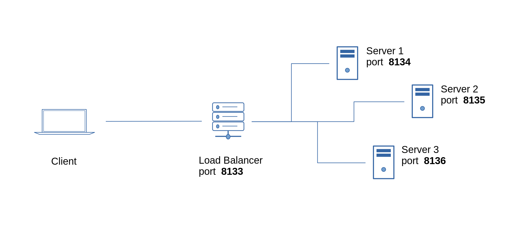

## Edge Load Balancing


<br>

#### Create a project directory for each edge endpoint and install *m2m*.
```js
$ npm install m2m
```
### Server 1
```js
const m2m = require('m2m')

// simulated data source
function dataSource(){
  return 20 + Math.floor(Math.random() * 10)
}

/***
 * tcp edge server 1
 */
let edge = new m2m.Edge({name:'server1'})
let port = 8134

m2m.connect(() => {
  edge.createServer(port, (server) => {

      server.dataSource('test-data', (tcp) => {
          tcp.send({server:1, topic:tcp.topic, value:dataSource()})         
      })

      server.on('error', (err) => { 
          console.log('error:', err.message)
      })
  })
})

```

### Server 2
```js
const m2m = require('m2m')

// simulated data source
function dataSource(){
  return 20 + Math.floor(Math.random() * 10)
}

/***
 * tcp edge server 2
 */
let edge = new m2m.Edge({name:'server2'})
let port = 8135

m2m.connect(() => {
  edge.createServer(port, (server) => {

      server.dataSource('test-data', (tcp) => {
          tcp.send({server:2, topic:tcp.topic, value:dataSource()})             
      })

      server.on('error', (err) => { 
          console.log('error:', err.message)
      })
  })
})

```

### Server 3
```js
const m2m = require('m2m')

// simulated data source
function dataSource(){
  return 20 + Math.floor(Math.random() * 10)
}

/***
 * tcp edge server 3
 */
let edge = new m2m.Edge({name:'server3'})
let port = 8136

m2m.connect(() => {
  edge.createServer(port, (server) => {

      server.dataSource('test-data', (tcp) => {
          tcp.send({server:3, topic:tcp.topic, value:dataSource()})       
      })

      server.on('error', (err) => { 
          console.log('error:', err.message)
      })
  })
})
```

### Load Balancer
```js
const m2m = require('m2m')

let edge = new m2m.Edger({name:'Load Balancer'})

m2m.connect(app)

function app(){
  /***
   * tcp edge clients
   */
  let ec1 = new edge.client(8134)
  let ec2 = new edge.client(8135)
  let ec3 = new edge.client(8136)

  /***
   * tcp edge loadbalancer
   */
  let port = 8133

  let load = 1 

  edge.createServer(port, (server) => {

      server.dataSource('test-data', (tcp) => { 
          if(load === 1){
            load = 2;
            ec1.read(tcp.topic, (data) => {
              tcp.send(data)  
            })   
          }
          else if(load === 2){
            load = 3;
            ec2.read(tcp.topic, (data) => {
              tcp.send(data)  
            })   
          }
          else if(load === 3){
            load = 1;
            ec3.read(tcp.topic, (data) => {
              tcp.send(data)  
            })  
          }
      })

      server.on('connection', (count) => { 
          console.log('connected client', count)
      })
  })
}
```

### Client
```js
const m2m = require('m2m')

let edge = new m2m.Edge({name:'client1'})

/***
 * tcp edge client 1
 */

let main = async () => {
  let result = await device.connect();
  console.log(result);

  let ec1 = new edge.client(8133)

  setInterval(async () => {

      ec1.read('test-data', (data) => {
          console.log('test-data', data)
      })

      // or

      let result = await  ec1.read('test-data')
      console.log('test-data', result)

      // or

      ec1.read('test-data')
      .then(console.log)

  }, 6000)

  ec1.on('error', (err) => { 
      console.log('error:', err.message)
  })
}

main()
```

<br>

#### Start the application on each endpoint.

<br>

You should get a client output similar to the result as shown below.
```js
test-data { server: 1, topic: 'test-data', value: 27 }
test-data { server: 2, topic: 'test-data', value: 25 }
test-data { server: 3, topic: 'test-data', value: 22 }


```


